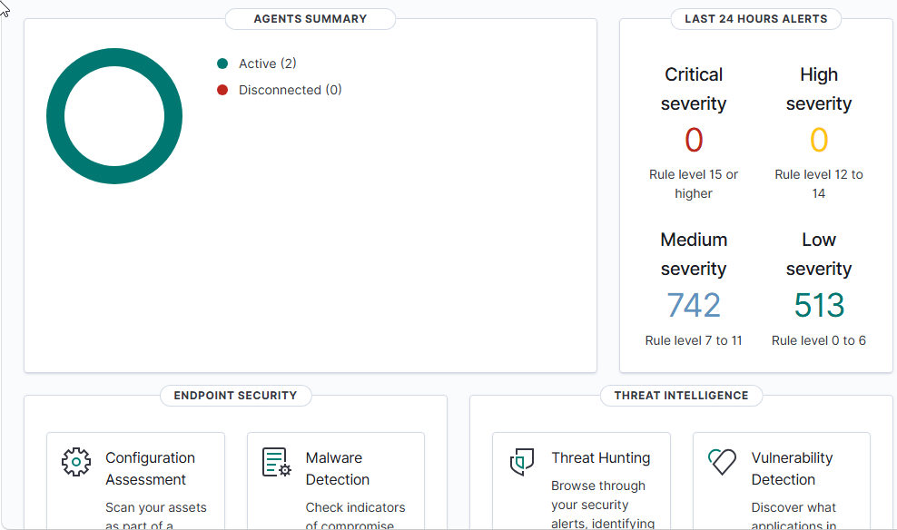
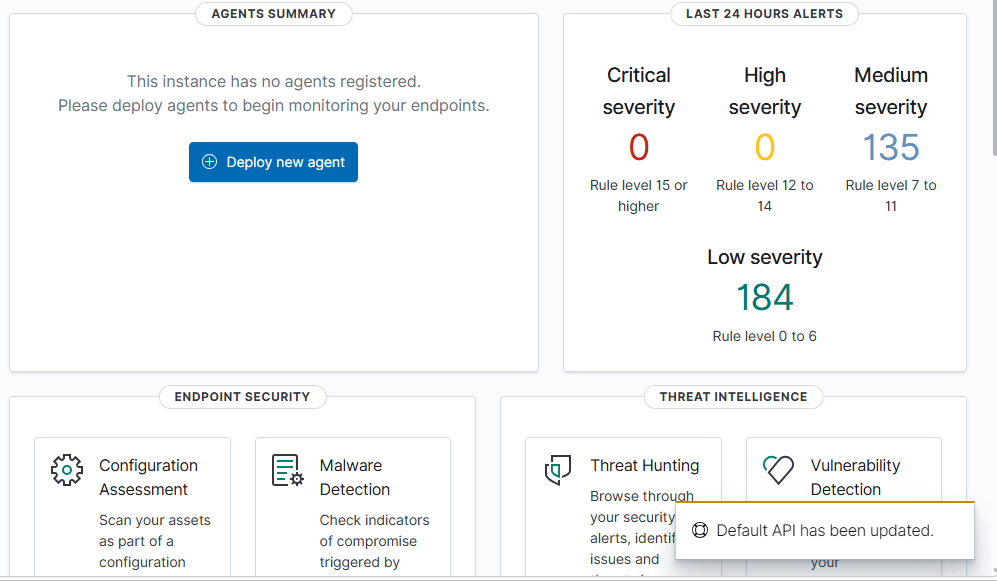
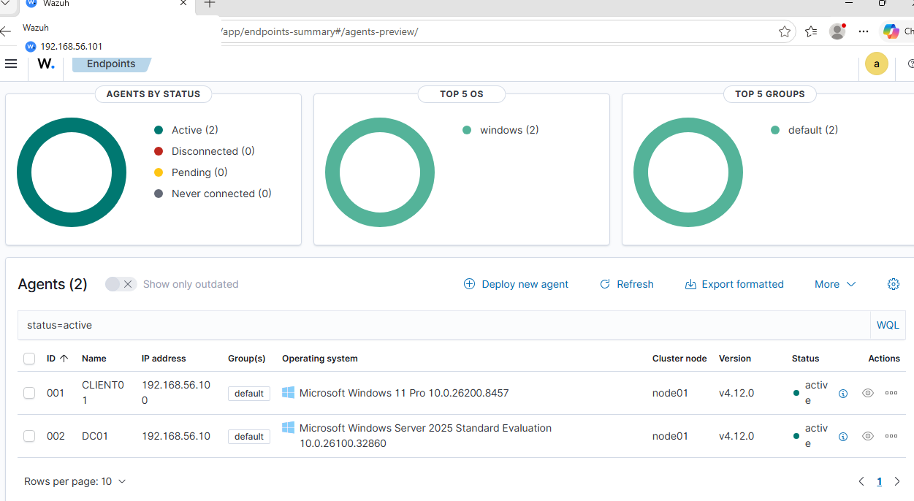
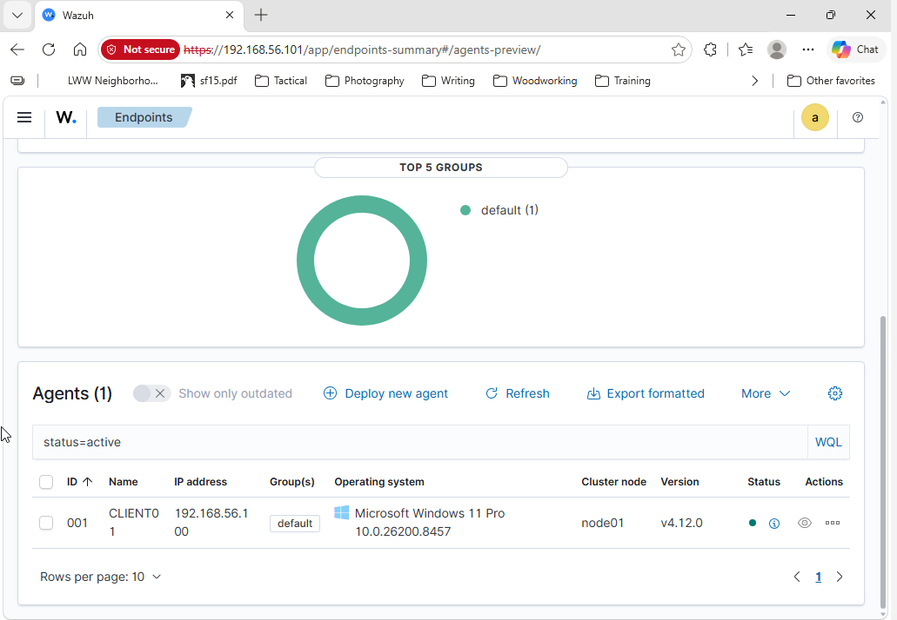
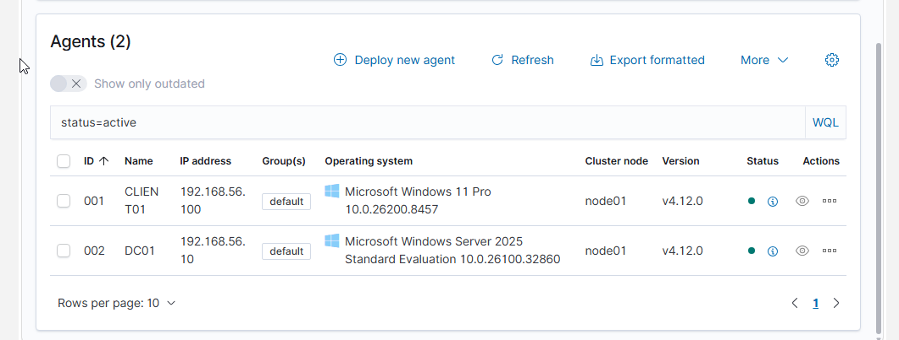
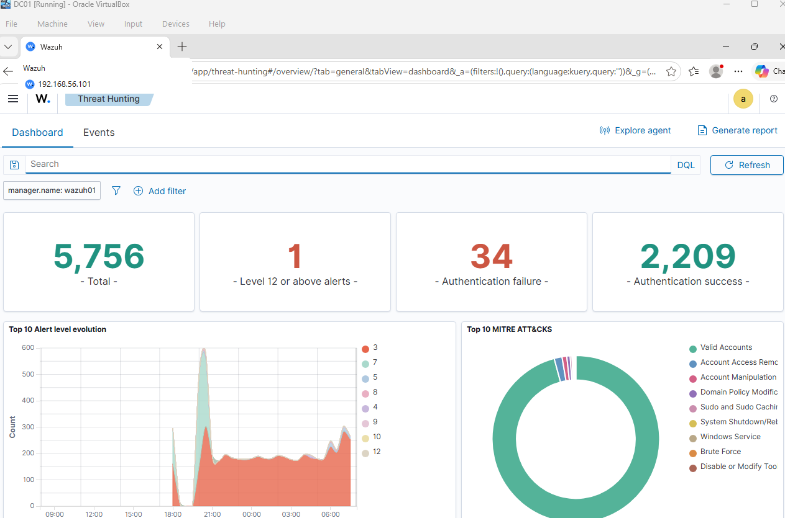
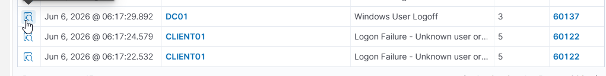
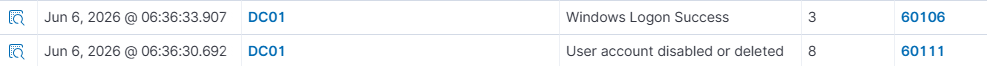
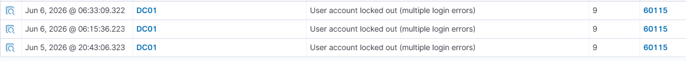
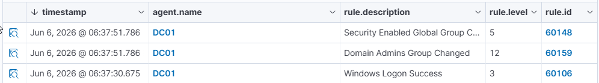

# 🛡️ Wazuh SIEM SOC Lab


---



## Project Overview

This project demonstrates the deployment and operation of a Security Information and Event Management (SIEM) environment using **Wazuh**, **Windows Server Active Directory**, and **Windows endpoints**.

The lab was designed to simulate a Security Operations Center (SOC) workflow by collecting logs, monitoring endpoint activity, investigating security alerts, and documenting incidents using industry-standard methodologies.

---

## 🎯 Objectives

* Deploy Wazuh SIEM from scratch
* Integrate Active Directory logging
* Monitor Windows endpoints
* Detect authentication failures
* Detect account lockouts
* Detect user account creation and deletion
* Detect privileged group modifications
* Conduct threat hunting investigations
* Create SOC-style incident reports
* Map detections to MITRE ATT&CK techniques

---

# 🏗️ Lab Architecture

```text
                    ┌──────────────────────┐
                    │    Wazuh Manager     │
                    │ Ubuntu Server 24.04 │
                    │ 192.168.56.101      │
                    └──────────┬───────────┘
                               │
               ┌───────────────┴───────────────┐
               │                               │
               │                               │
      ┌────────▼────────┐          ┌──────────▼─────────┐
      │      DC01       │          │      CLIENT01      │
      │ Windows Server  │          │ Windows 11 Pro     │
      │ Active Directory│          │ Wazuh Agent        │
      └─────────────────┘          └────────────────────┘
```

---

# 🔧 Technologies Used

| Technology          | Purpose             |
| ------------------- | ------------------- |
| Wazuh               | SIEM Platform       |
| Ubuntu Server       | Wazuh Manager       |
| Windows Server 2025 | Domain Controller   |
| Active Directory    | Identity Management |
| Windows 11 Pro      | Endpoint Monitoring |
| VirtualBox          | Virtualization      |
| PowerShell          | Administration      |
| Event Viewer        | Log Generation      |
| MITRE ATT&CK        | Threat Mapping      |
| GitHub              | Documentation       |

---

# 💪 Skills Demonstrated

### Security Operations

* SIEM Administration
* Threat Hunting
* Security Monitoring
* Incident Response
* Event Correlation
* Alert Triage

### Windows Security

* Active Directory Administration
* Windows Event Logging
* Authentication Monitoring
* Privileged Access Monitoring

### Technical Skills

* Wazuh Deployment
* Agent Management
* Log Analysis
* Endpoint Monitoring
* PowerShell
* Virtualization

---

# 🚀 Environment Deployment

## Initial Wazuh Installation

The Wazuh Manager was deployed and validated before endpoint enrollment.



---

## Agent Enrollment

After deployment, Windows endpoints were successfully registered with the SIEM.


---

## Endpoint Inventory

Both Windows systems successfully reported to Wazuh.



### Monitored Assets

| Host     | Purpose                            |
| -------- | ---------------------------------- |
| DC01     | Active Directory Domain Controller |
| CLIENT01 | Windows Endpoint                   |

---

## Endpoint Details

### CLIENT01



### DC01



---

# 🔍 Threat Hunting

The Wazuh Threat Hunting module was used to investigate security events generated throughout the environment.

Capabilities demonstrated:

* Authentication Monitoring
* User Activity Monitoring
* Account Lockout Detection
* Privileged Group Monitoring
* Event Correlation
* MITRE ATT&CK Mapping



---

# 🚨 Security Investigations

## Investigation #1 – Failed Logon Activity

### Alert



| Field        | Value             |
| ------------ | ----------------- |
| Rule ID      | 60122             |
| Severity     | 5                 |
| Event        | Logon Failure     |
| MITRE ATT&CK | T1110 Brute Force |

### Findings

Multiple failed authentication attempts were generated and successfully detected by Wazuh.

---

## Investigation #2 – User Account Creation

### Alert


| Field    | Value                |
| -------- | -------------------- |
| Rule ID  | 60109                |
| Severity | 8                    |
| Event    | User Account Created |

### Findings

New account creation activity was detected and logged by Wazuh.

---

## Investigation #3 – User Account Deletion

### Alert



| Field    | Value                |
| -------- | -------------------- |
| Rule ID  | 60111                |
| Severity | 8                    |
| Event    | User Account Deleted |

### Findings

Account deletion activity was successfully monitored and investigated.

---

## Investigation #4 – Account Lockout

### Alert



| Field        | Value             |
| ------------ | ----------------- |
| Rule ID      | 60115             |
| Severity     | 9                 |
| Event        | Account Lockout   |
| MITRE ATT&CK | T1110 Brute Force |

### Findings

Repeated failed login attempts triggered the account lockout policy and generated a security alert.

---

## Investigation #5 – Domain Admins Group Modification

### Alert



| Field    | Value                       |
| -------- | --------------------------- |
| Rule ID  | 60159                       |
| Severity | 12                          |
| Event    | Domain Admins Group Changed |

### MITRE ATT&CK

* T1098 – Account Manipulation
* T1484 – Domain Policy Modification

### Findings

A privileged Active Directory group modification was detected by Wazuh and escalated as a high-severity alert.

This represents one of the most security-sensitive events generated during the lab.

---

# 📄 Incident Reports

Formal SOC-style incident reports were created for each major investigation.

## Available Reports

### Domain Admins Group Change

```text
incident-reports/INC-2026-001-Domain-Admins-Group-Change.pdf
```

### Account Lockout

```text
incident-reports/INC-2026-002-Account-Lockout.pdf
```

### Failed Logon Investigation

```text
incident-reports/INC-2026-003-Failed-Logon.pdf
```

---

# 🎯 MITRE ATT&CK Coverage

| Technique | Description                |
| --------- | -------------------------- |
| T1110     | Brute Force                |
| T1078     | Valid Accounts             |
| T1098     | Account Manipulation       |
| T1484     | Domain Policy Modification |

---

# 📚 Lessons Learned

Throughout this project I gained hands-on experience with:

* SIEM deployment and management
* Wazuh agent enrollment and troubleshooting
* Active Directory security monitoring
* Authentication event analysis
* Account lockout investigations
* Threat hunting workflows
* MITRE ATT&CK mapping
* SOC documentation standards
* Incident reporting procedures

---

# 🔮 Future Improvements

* Sysmon Integration
* Custom Wazuh Detection Rules
* Sigma Rule Conversion
* PowerShell Attack Simulations
* Malware Analysis Workstation
* Vulnerability Management Integration
* Multi-site Agent Deployment
* Automated Incident Response Playbooks

---

# 🏆 Project Outcomes

Successfully built a functioning Security Operations Center lab capable of:

✅ Monitoring Windows endpoints

✅ Collecting and correlating security logs

✅ Detecting suspicious authentication activity

✅ Detecting account management events

✅ Detecting privileged access changes

✅ Performing threat hunting investigations

✅ Producing formal incident reports

✅ Mapping detections to MITRE ATT&CK

---

# 👨‍💻 Author

**Brandon J. Cooper**

Cybersecurity • SOC Analyst • IT Support • Security Operations

GitHub Portfolio Project – Wazuh SIEM SOC Lab
